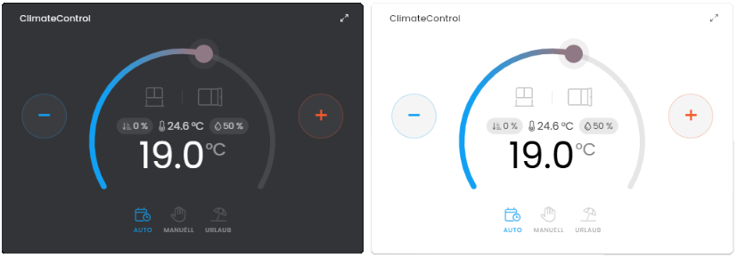

# 🌡️ ClimateControl

[](https://www.symcon.de/service/dokumentation/entwicklerbereich/sdk-tools/sdk-php/)
[](https://www.symcon.de/produkt/)
[](https://github.com/Wilkware/ClimateControl)
[](https://creativecommons.org/licenses/by-nc-sa/4.0/)
[](https://github.com/Wilkware/ClimateControl/actions)

Visuelle Steuerung von Heizung, Kühlung und Klimaanlagen über ein interaktives, vollständig skalierbares HTML-SDK-Widget.

 

## Inhaltsverzeichnis

1. [Funktionsumfang](#user-content-1-funktionsumfang)
2. [Voraussetzungen](#user-content-2-voraussetzungen)
3. [Installation](#user-content-3-installation)
4. [Einrichten der Instanzen in IP-Symcon](#user-content-4-einrichten-der-instanzen-in-ip-symcon)
5. [Statusvariablen und Darstellungen](#user-content-5-statusvariablen-und-darstellungen)
6. [Visualisierung](#user-content-6-visualisierung)
7. [PHP-Befehlsreferenz](#user-content-7-php-befehlsreferenz)
8. [Versionshistorie](#user-content-8-versionshistorie)

### 1. Funktionsumfang

* Interaktive, kreisförmige Temperatur-Anzeige (Gauge) mit Farbverlauf von Kalt- zu Warm-Farbe
* Zieltemperatur per Ziehen des Reglers, Antippen des Bogens oder über separate Plus-/Minus-Tasten einstellbar
* Anzeige der Ist-Temperatur, optional erweiterbar um relative Luftfeuchte und Ventilstellung
* Zwei frei konfigurierbare Status-Icons (z. B. „Fenster offen“, „Prognose“), jeweils an eine eigene Variable gebunden
* Frei konfigurierbare Betriebsmodi (z. B. Urlaub, Programm, Manuell, Pause, Aus) mit eigenem Icon, Name und Farbe je Modus
* Komfortabler Import der verfügbaren Modi direkt aus dem Profil bzw. der Darstellung der Modus-Variable per Knopfdruck
* Vollständig responsives Layout (HTML-SDK/Container Queries) – Gauge, Icons und Beschriftungen skalieren automatisch mit der Kachelgröße
* Automatische Anpassung an Hoch- und Querformat, inklusive Plus-/Minus-Tasten im Querformat
* Automatische Unterstützung von hellem und dunklem Theme

### 2. Voraussetzungen

- IP-Symcon ab Version 8.1

### 3. Installation

* Über den Modul Store die Bibliothek _Klimaregler_ (engl. _ClimateControl_) installieren.
* Alternativ über das Modul-Control folgende URL hinzufügen.  
`https://github.com/Wilkware/ClimateControl` oder `git://github.com/Wilkware/ClimateControl.git`

### 4. Einrichten der Instanzen in IP-Symcon

* Unter "Instanz hinzufügen" ist das 'Klimaregler'-Modul unter dem Hersteller '(Sonstige)' aufgeführt.

__Konfigurationsseite__:

Einstellungsbereich:

> 🌡️ Klimadaten ...

Name                       | Beschreibung
-------------------------- | ---------------------------------
Ist-Temperature            | Variable, die die aktuelle (Ist-)Temperatur liefert.
Soll-Temperature           | Variable, die die Ziel-(Soll-)Temperatur liefert bzw. per Gauge gesetzt wird.
Ventilstellung (optional)  | Optionale Variable für die Position des Heizventils. Bleibt das Feld leer, wird der Wert in der Visualisierung nicht angezeigt.
Luftfeuchte (optional)     | Optionale Variable für die (relative) Luftfeuchte. Bleibt das Feld leer, wird der Wert in der Visualisierung nicht angezeigt.
Status-Icon links / rechts | Liste mit genau zwei Einträgen für die Status-Icons links/rechts in der Gauge (z. B. Fenster, Prognose). Pro Eintrag: Variable, Name, Wert, Icon und Farbe. Bleibt die Variable eines Eintrags leer, wird das entsprechende Icon ausgeblendet.
Aktiver Modus               | Variable, die den aktuell aktiven Modus liefert (Wert muss zu einem der Einträge in der Modus-Liste passen).
VARIABLE ANALYSIEREN        | Liest die Assoziationen aus dem Profil bzw. der Darstellung der gewählten Modus-Variable ein und übernimmt sie automatisch in die Modus-Liste. Bereits manuell angepasste Icons/Farben bleiben dabei erhalten.
LISTE LEEREN                | Löscht alle Werte aus der Modus-Liste. Wichtig wenn man eine andere Variable verlinkt, welche mit den vorheriegen Einstellungen nicht zusammenpasst.
Verfügbare Modi             | Liste der verfügbaren Betriebsmodi. Name, Icon und Farbe können frei angepasst werden; der zugrundeliegende Wert wird aus dem Profil übernommen.

> ✨ Visualisierung ...

Name                                       | Beschreibung
------------------------------------------ | -----------------------------------
Farbe (KALT)                               | Farbe für das kalte Ende des Temperatur-Farbverlaufs.
Farbe (WARM)                               | Farbe für das warme Ende des Temperatur-Farbverlaufs.
Status-Beschriftungen anzeigen?            | Blendet die Beschriftung unter den Status-Icons ein oder aus.
Modus-Beschriftungen anzeigen?             | Blendet die Beschriftung unter den Modus-Icons ein oder aus.

> ⚙️ Erweiterte Einstellungen ...

Name                                       | Beschreibung
------------------------------------------ | -----------------------------------
Steuerungsaktivitäten an Script übergeben: | Alle angefragten Aktivitäten werden an das Script weitergereicht (INSTANCE, TIMESTAMP, TYPE, VARIABLE und VALUE).

__Beispiel:__
```php
Array (
    [SELF] => 18056
    [THREAD] => 13
    [SENDER] => RunScript
    [VALUE] => 1
    [VARIABLE] => 12636
    [TYPE] => status
    [TIMESTAMP] => 1783344616
    [INSTANCE] => 47757
)
```

### 5. Statusvariablen und Darstellungen

Es werden keine zusätzlichen Statusvariablen unf Profile/Darstellungen benötigt.

### 6. Visualisierung

Man kann gesamte Modul (HTML-SDK Support) direkt in der Visualisierung verlinken.

### 7. PHP-Befehlsreferenz

Das Modul stellt keine direkten Funktionsaufrufe zur Verfügung.

### 8. Versionshistorie

v1.1.20260708

* _NEU_: Ventilstellung erlaubt auch boolsche Variable (false = 0%, true = 100%)
* _FIX_: Modusliste kann jetzt auch mit benutzerdefinierten Darstellungen umgehen
* _FIX_: Ration zwischen Quer- und Hochformat angepasst, Buttons erscheinen jetzt etwas später
* _FIX_: Kit-Icons (fak) werden jetzt auch korrekt angezeigt

v1.0.20260706

* _NEU_: Initialversion

## Entwickler

Seit nunmehr über 10 Jahren fasziniert mich das Thema Haussteuerung. In den letzten Jahren betätige ich mich auch intensiv in der Symcon Community und steuere dort verschiedenste Skripte und Module bei. Ihr findet mich dort unter dem Namen @pitti ;-)

[](https://wilkware.github.io/)

## Spenden

Die Software ist für die nicht kommerzielle Nutzung kostenlos, über eine Spende bei Gefallen des Moduls würde ich mich freuen.

[](https://www.paypal.com/cgi-bin/webscr?cmd=_s-xclick&hosted_button_id=8816166)

## Lizenz

Namensnennung - Nicht-kommerziell - Weitergabe unter gleichen Bedingungen 4.0 International

[](https://creativecommons.org/licenses/by-nc-sa/4.0/)
